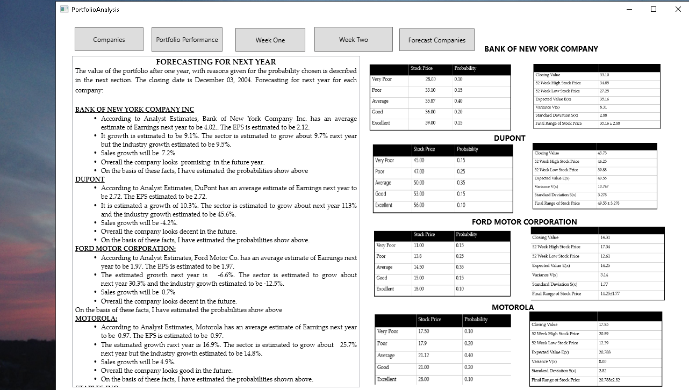
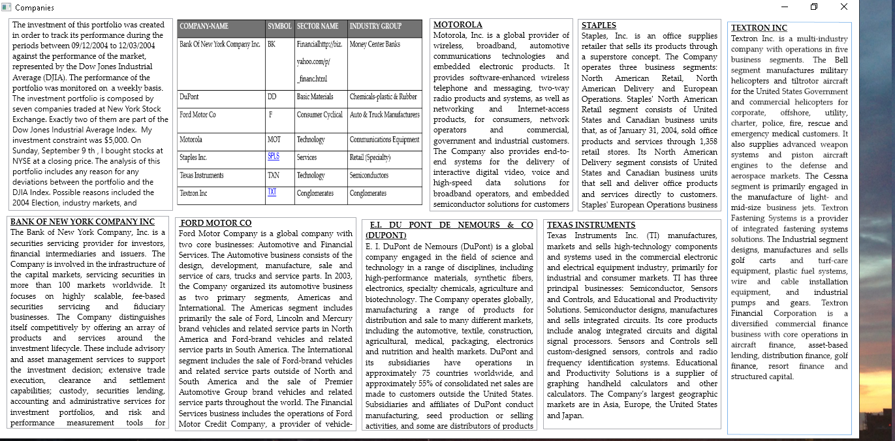
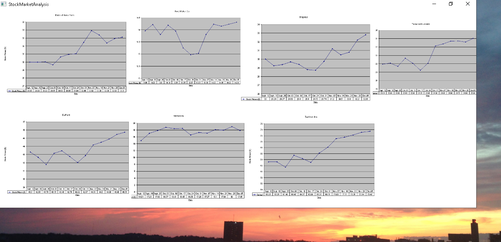
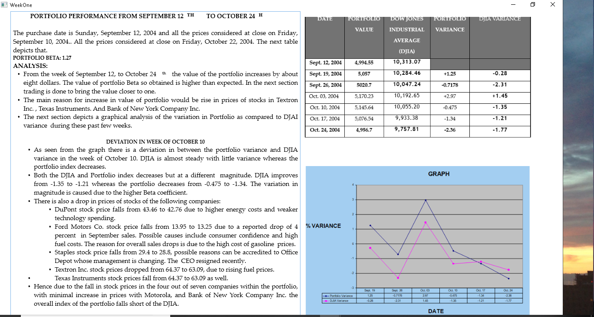
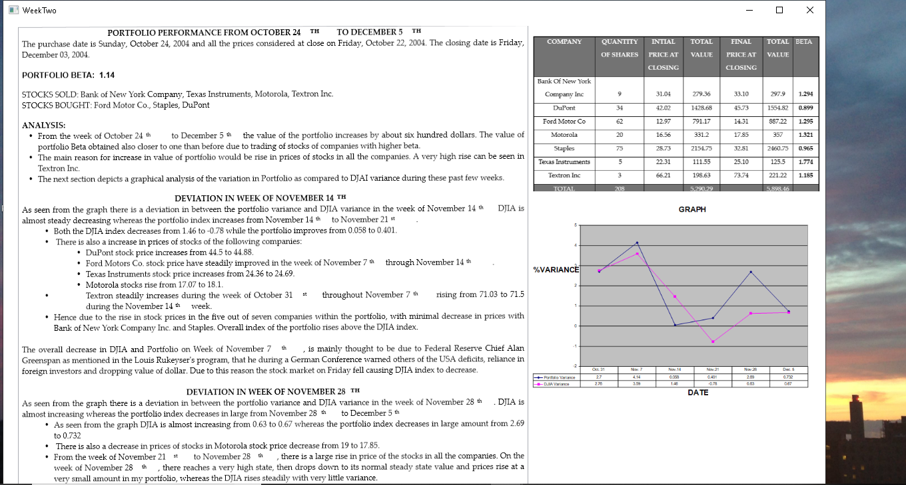
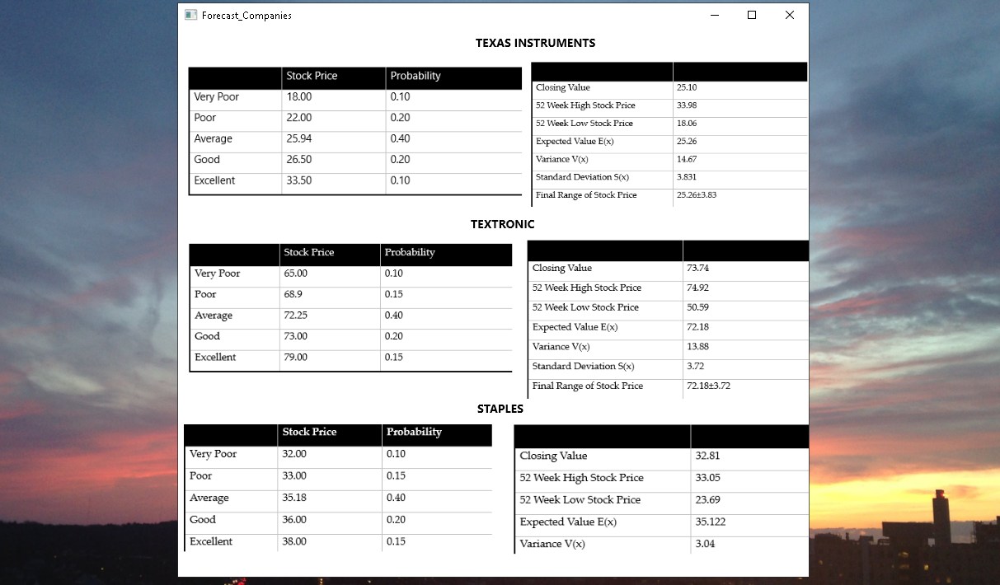
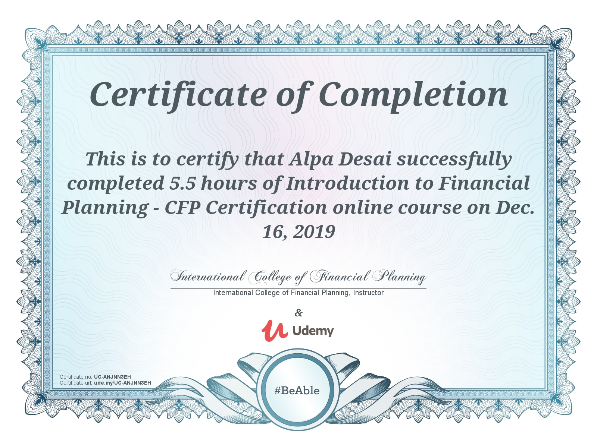

# Financial Markets

The project provides an introduction to financial markets and institutions. 
For details, please click on the executable located in https://github.com/alpaddesai/FinancialMarkets/releases 
Company confidential information is not displayed. All images are either custom by Alpa D Desai or a reference name is included. Most of the images are custom. 

## Capital Markets

## Government Regulations

## Portfolio Analysis

## Companies

## Stock Market

## Weekly Portfolio Analysis

## Weekly Portfolio Analysis Cntd

## Forecast Companies

## Prediction Models

## CFA exam

Additional reference : https://github.com/alpaddesai/BusinessDevelopmentMergersAcquisitionsIdea
